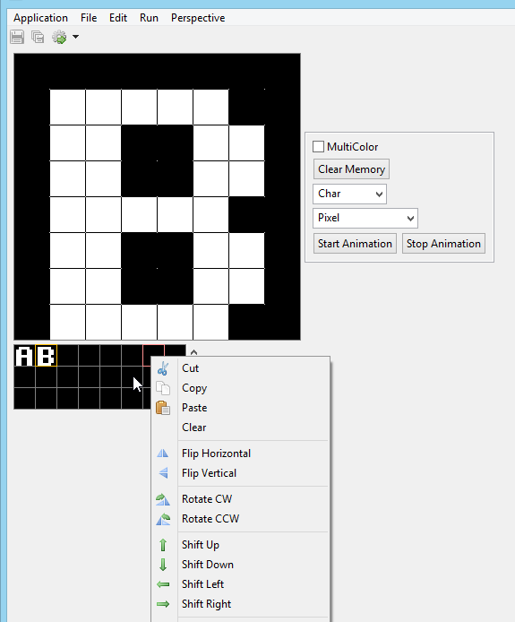
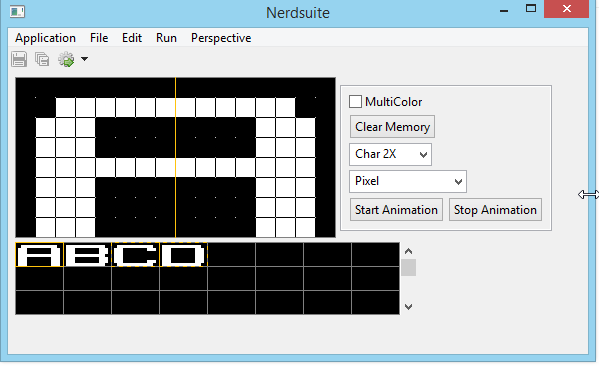
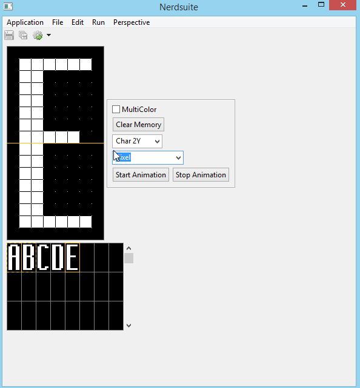
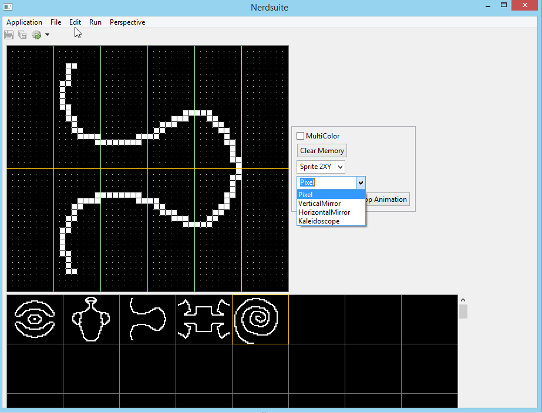
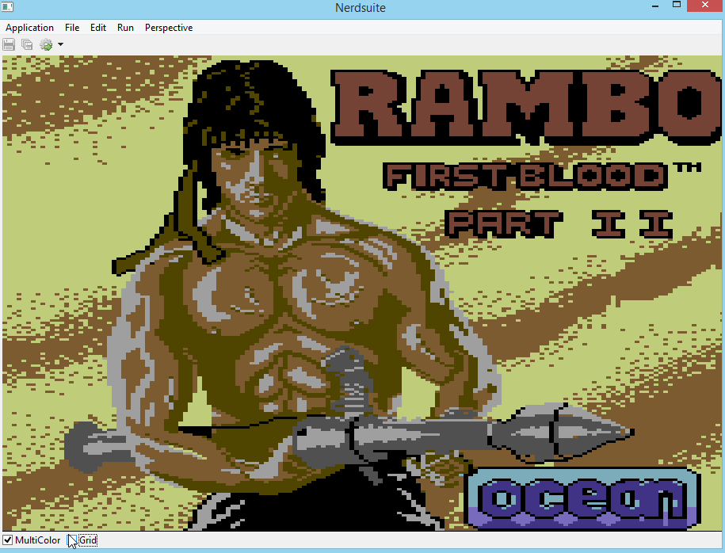

#Nerdsuite 
###### An application based on Eclipse RCP Mars

###### Nerdsuite should be an IDE for good old 8Bit coding, like for C64 or Atari 800XL.
###### It is currently in an very early alpha state

 